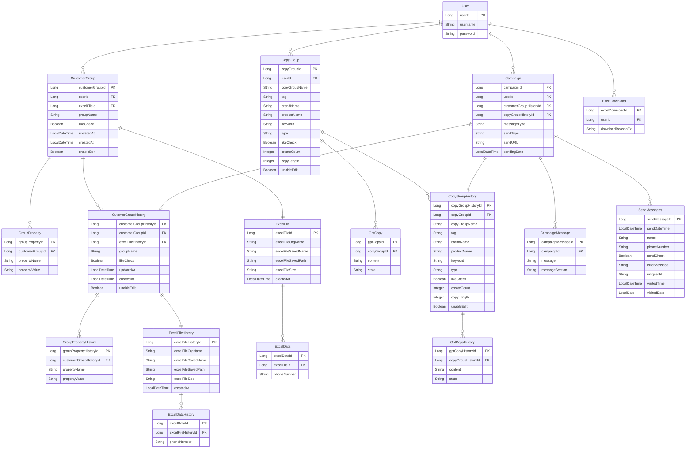

## 🪡 Stack 🪡
- Java 17
- Spring
- Spring Boot
- Spring Data JPA
- Query DSL
- MySQL
- Spring Security + JWT Token
- AWS EC2 , RDS(MySQL)
<br>

## 🌟 Commit Convention 🌟

>### git flow

> 👉 참고 사이트: [우형 기술 블로그](https://techblog.woowahan.com/2553/)
> 
1. **master**(기준) 역할은 `team-24` 브랜치이다. (최종 배포용)
2. **master**에서 개발할 브랜치인 `dev` 을 생성한다. 
    - PR 용으로 사용하는 FE, BE develop 브랜치가 있다
    - 개발자들은 이 브랜치를 베이스로 개발한다
    - 예) BE 는 `dev` 를 베이스로 기능개발 브랜치를 딴다.

1. 개발할 기능이 생기면 **issue** 를 작성한다
    1. **issue convention** 참고

```
team-24(master)
  |
  └── dev
				|
        ├── feat-기능이름1
	      │── feat-기능이름2
        │── feat-기능이름3   
        └── feat-기능이름
            
```

>### issue

issue 를 쓸때 작업 흐름

1. issue 생성
    1. 작업에 대한 상세 내용
    2. 작업에 대한 작은 기능들을 체크박스로 readme 작성

```
기능제목 [태그1][태그2]
---

## 💡 issue
[FEAT] CollectionView 구현

## 📝 todo
[ ] 작업1
[ ] 작업2
[ ] 작업3
```

>### commit

작업에 대한 간략한 키워드를 제목 가장 앞에 추가한다.

작업의 자세한 내용은 제목에서 한줄 띄우고 쓰도록 한다.

- `feature`: 새로운 기능을 추가할 경우
- `fix`: 버그를 고친 경우
- `refactor`: 프로덕션 코드 리팩터링
- `test`: 테스트 추가, 테스트 리팩터링 (프로덕션 코드 변경 없음)
- `setting` : 초기 셋팅

```
키워드: 작업 제목 
//공백//
자세한 내용1 내용내용내용내용
내용내용222222

예) 
feat: 컬렉션뷰 ViewController 에 적용 

컬렉션뷰를 ViewController 에 적용했다
```
<br>

## 🌟 ERD 🌟

---
# [API 명세서](https://documenter.getpostman.com/view/22820772/2s93CNNZ8b)
